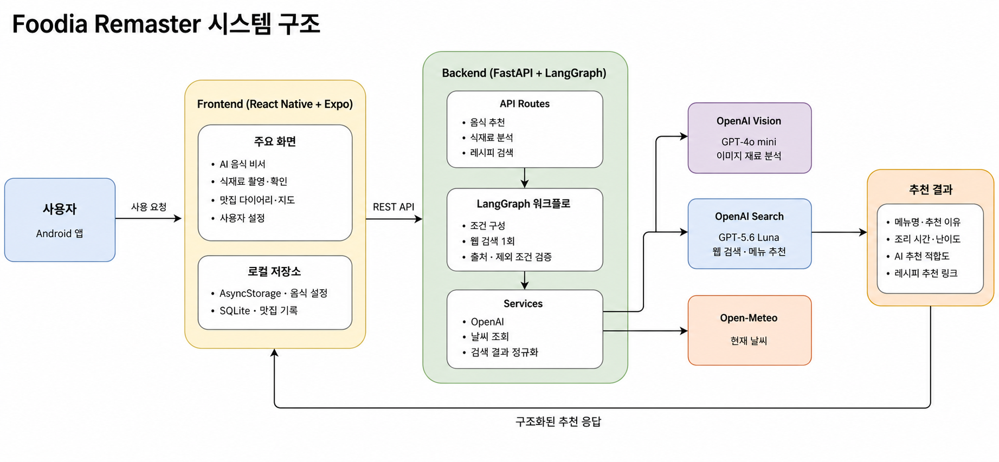

<p align="center">
  
</p>

<h1 align="center">Foodia Remaster</h1>

<p align="center">
  날씨,재료,개인 기록을 조합해 메뉴 결정을 돕는 AI 입니다
</p>

## 프로젝트 소개

Foodia Remaster는 사용자의 자연어 요청뿐 아니라 현재 날씨와 계절, 알레르기와 제외 재료, 좋아하는 음식, 최근 메뉴와 즐겨찾기 맛집 기록을 함께 고려해 메뉴를 추천하는 애플리케이션입니다.

기존의 고정 레시피 DB와 YOLO 탐지 서버를 제거하고 다음 구조로 리마스터했습니다.

- OpenAI 비전 모델을 이용한 식재료 이미지 분석
- LangGraph로 분리한 재료 인식,음식 추천,레시피 검증 워크플로
- 만개의레시피 도메인으로 실시간 검색
- 실제 검색 출처 URL을 포함하는 구조화된 추천 결과
- 별도 사용자 DB 없이 모바일 로컬 저장소에 보관하는 취향과 맛집 기록

## 주요 기능

### AI 음식 비서

- 자연어로 원하는 음식이나 상황 입력
- 현재 날짜,계절과 위치 기반 날씨 반영
- 알레르기 및 싫어하는 재료 제외
- 좋아하는 음식과 평점 높은 맛집 메뉴 반영
- 최근 먹은 메뉴의 반복 추천 방지
- 만개의레시피 원문 링크가 있는 메뉴 목록 제공

### 식재료 이미지 분석

- OpenAI 이미지 입력으로 식재료 후보와 신뢰도 추출
- 사용자가 탐지 결과를 확인하고 수정한 뒤 추천에 사용

### 맛집 다이어리

- 식당명, 메뉴, 사진, 평점과 메모 기록
- 즐겨찾기한 메뉴를 AI 추천 취향 신호로 사용
- 지도에서 기록 위치 확인
- 마커 선택 후 네이버 지도에서 해당 위치 열기

### 사용자 설정

- 최초 실행 시 알레르기, 싫어하는 재료와 좋아하는 음식 등록
- 날씨·계절·맛집 기록 반영 여부 설정
- 최근 메뉴 제외 기간 설정
- AsyncStorage와 SQLite를 이용한 기기 로컬 저장

## 시스템 구조



## LangGraph 워크플로

### 음식 비서

```text
사용자 요청
  → 날짜·날씨·취향·맛집·제외 조건 구성
  → 검색어 생성
  → 만개의레시피 웹 검색 1회
  → 출처와 사용자 조건 검증
  → 추천 목록 생성
```

검색이 8초 안에 완료되지 않으면 앱이 멈추지 않도록 만개의레시피 검색 결과 링크를 포함한 대체 응답을 반환합니다.

### 식재료 인식

```text
이미지 형식·크기 검증
  → Base64 인코딩
  → AI 식재료 탐지
  → 명칭 정규화와 중복 제거
  → 사용자 확인
```

### 레시피 검색

```text
검색 조건 생성
  → 만개의레시피 한정 웹 검색
  → 구조화된 레시피 후보 생성
  → URL·제외 재료·조리 시간 검증
  → 결과 반환
```

## RAG 구성

Foodia는 벡터 DB에 문서를 미리 적재하는 전통적인 RAG 대신 OpenAI `web_search`를 Retrieval 계층으로 사용하는 **실시간 Web RAG 패턴**을 적용했습니다.

| 단계         | Foodia 구현                                             |
| ------------ | ------------------------------------------------------- |
| Retrieval    | `10000recipe.com`으로 제한한 OpenAI 웹 검색             |
| Augmentation | 검색 결과에 날씨, 취향, 보유·제외 재료와 최근 기록 결합 |
| Generation   | 출처 URL을 포함한 구조화된 메뉴·레시피 생성             |
| Validation   | 허용 도메인, 실제 검색 URL, 제외 재료와 조리 시간 검사  |

현재 구조에는 임베딩 모델, 문서 청킹, FAISS·Chroma·Pinecone 같은 벡터 DB가 없습니다.

## OpenAI 모델 역할

| 환경변수              | 기본 모델      | 역할                               | 현재 상태             |
| --------------------- | -------------- | ---------------------------------- | --------------------- |
| `OPENAI_VISION_MODEL` | `gpt-4o-mini`  | 이미지 속 식재료 탐지              | 사진 분석 시 사용     |
| `OPENAI_RECIPE_MODEL` | `gpt-4o-mini`  | 검색된 레시피의 AI 2차 검증        | 기본값 비활성화       |
| `OPENAI_SEARCH_MODEL` | `gpt-5.6-luna` | 만개의레시피 검색과 빠른 메뉴 추천 | 음식 비서의 핵심 모델 |

기본 설정은 `ENABLE_LLM_RECIPE_VERIFICATION=false`입니다. Python 규칙 기반 검증을 우선해 응답 시간과 비용을 줄였으며, 필요할 때 AI 2차 검증을 활성화할 수 있습니다.

## 기술 스택

| 영역        | 기술                                                 |
| ----------- | ---------------------------------------------------- |
| Mobile      | React Native 0.86, Expo SDK 57, React Navigation     |
| Local data  | AsyncStorage, Expo SQLite                            |
| Map         | OpenStreetMap, Leaflet, React Native WebView         |
| Backend     | Python 3.13, FastAPI, Uvicorn, Pydantic              |
| AI workflow | LangGraph, LangChain OpenAI                          |
| AI API      | OpenAI Responses API, Structured Outputs, Web Search |
| Weather     | Open-Meteo API                                       |
| Android     | Kotlin, Gradle, Android SDK 36                       |

## 디렉터리 구조

```text
Foodia_remaster/
├─ frontend-expo/             # React Native · Expo 모바일 앱
│  ├─ src/
│  │  ├─ api/                 # FastAPI 요청 모듈
│  │  ├─ components/          # 공통 UI와 지도 컴포넌트
│  │  ├─ context/             # 사용자 음식 설정 상태
│  │  ├─ screens/             # AI 비서·맛집 기록·설정 화면
│  │  ├─ services/            # 추천 요청 컨텍스트 구성
│  │  └─ storage/             # SQLite 맛집 기록
│  ├─ android/                # Android 네이티브 프로젝트
│  └─ build-release-apk.ps1   # 서명 APK 빌드 스크립트
│
└─ backend/                   # FastAPI · LangGraph 백엔드
   ├─ src/
   │  ├─ routes/              # REST API 엔드포인트
   │  ├─ schemas/             # 요청·응답 스키마
   │  ├─ prompts/             # AI 역할과 검증 규칙
   │  ├─ services/            # OpenAI·검색·날씨 서비스
   │  └─ workflows/foodia/    # 그래프·노드·상태 정의
   └─ tests/                  # 백엔드 단위 테스트
```

## 로컬 실행

### 요구사항

- Node.js 24.18 이상
- Python 3.13
- JDK 21
- Android Studio 및 Android SDK 36
- OpenAI API 키

### 백엔드

```powershell
cd backend
py -3.13 -m venv .venv
.\.venv\Scripts\python.exe -m pip install -r requirements-dev.txt
```

`backend/.env` 파일을 만들고 다음 값을 설정합니다.

```ini
OPENAI_API_KEY=your_api_key
OPENAI_VISION_MODEL=gpt-4o-mini
OPENAI_RECIPE_MODEL=gpt-4o-mini
OPENAI_SEARCH_MODEL=gpt-5.6-luna
RECIPE_SEARCH_DOMAIN=10000recipe.com
ENABLE_LLM_RECIPE_VERIFICATION=false
RECIPE_MAX_RETRIES=0
ASSISTANT_TIMEOUT_SECONDS=8
```

서버를 실행합니다.

```powershell
.\.venv\Scripts\python.exe -m uvicorn src.app:app --reload --host 0.0.0.0 --port 8000
```

- Swagger UI: `http://127.0.0.1:8000/docs`
- 상태 확인: `http://127.0.0.1:8000/health`

### Android 앱

```powershell
cd frontend-expo
npm install
npx.cmd expo run:android
```

Android 에뮬레이터는 기본적으로 `http://10.0.2.2:8000`의 로컬 백엔드에 연결합니다. 실제 기기나 배포 빌드는 공개 HTTPS 백엔드를 지정해야 합니다.

```powershell
$env:EXPO_PUBLIC_API_URL='https://your-api.example.com'
npx.cmd expo run:android
```

## 릴리스 APK

64비트 ARM Android 실기기용 서명 APK를 생성합니다.

```powershell
cd frontend-expo
.\build-release-apk.ps1
```

결과 파일:

```text
frontend-expo/android/app/build/outputs/apk/release/app-release.apk
```

`foodia-upload-key.jks`와 `android/keystore.properties`는 Git에서 제외됩니다. 동일한 앱의 업데이트 서명에 필요하므로 별도 보안 저장소에 반드시 백업해야 합니다.

## API

| Method | Endpoint                      | 설명                     |
| ------ | ----------------------------- | ------------------------ |
| `GET`  | `/health`                     | 서버 상태 확인           |
| `POST` | `/api/v1/assistant/recommend` | 개인화 AI 음식 추천      |
| `POST` | `/api/v1/ingredients/analyze` | 이미지 식재료 분석       |
| `POST` | `/api/v1/recipes/search`      | 재료 기반 웹 레시피 검색 |

## 테스트

```powershell
cd backend
.\.venv\Scripts\python.exe -m pytest
```

## 설계 선택과 한계

- 별도 사용자 DB를 제거해 운영 복잡도를 줄이고 개인 기록은 기기에 저장했습니다.
- 추천에 필요한 취향과 맛집 정보는 요청 시 백엔드와 OpenAI에 전달됩니다.
- AI가 알레르기 안전을 완전히 보장할 수 없으므로 사용자는 원문 레시피와 제품 표시를 다시 확인해야 합니다.
- 8초 대체 응답은 상세 레시피 검증 대신 검색 결과 페이지를 제공할 수 있습니다.
- 현재 릴리스 APK는 `arm64-v8a` Android 실기기용입니다.

## License

This project is licensed under the [MIT License](frontend-expo/LICENSE).
